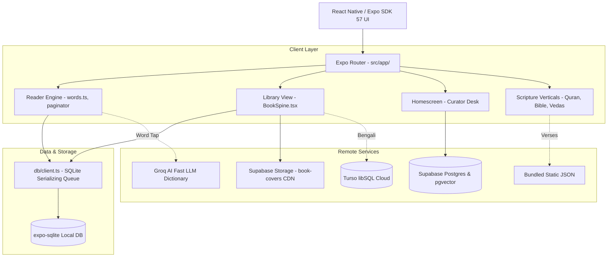

# Lamplight — Visual Blueprint & Context Guide

> **Audience**: AI agents, engineers, and designers working on Lamplight.
> **Purpose**: A comprehensive mental model and visual wireframe guide to understand, visualize, and build on the Lamplight mobile reading sanctuary without visual drift or architectural regressions.

---

## 1. The Soul & Identity of Lamplight

Lamplight is not an ebook reader; it is an **1890s candlelit private library**.

### Core Philosophy
* **Tactile Literary Sanctuary**: Books feel like tangible physical artifacts—heavy cloth bindings, deckled edges, gilded titles, and an authentic paper-curl corner on every book cover.
* **Warmth over Clinical Minimalism**: Digital reading apps are sterile and cold. Lamplight is warm parchment, amber lantern light, and weathered ink.
* **Ambient Contemplation**: Soundscapes of gentle fireplace embers, soft midnight rain, and library whispers accompany the reader. No synthetic music.
* **Global Classical Heritage**: Spans Western canon (Gutenberg), Bengali renaissance classics (Turso), Japanese literature (Aozora Bunko 17,000+ works), Korean modernism & traditional tales (Gongu Madang), and sacred scriptures (Quran, Bible, Vedas).

---

## 2. Design System & Visual Tokens

The source of truth lives in `src/theme/tokens.ts`, `typography.ts`, and `ThemeProvider.tsx`.

### The Locked Brand Constants
| Token | Hex / Value | Role |
|---|---|---|
| **Primary Dark** | `#1C1B1E` | Deep obsidian lamp black. Never pure `#000000`. |
| **Flame Amber** | `#F5A623` | The one recurring radiant accent: lantern embers, word lookups, active markers. |
| **Parchment** | `#F5EDE1` | The tactile paper base for Day mode and light cards. |
| **Reading Floor** | `Lora, >= 17px, line-height >= 1.85` | The reading body floor. **Never shrink this ratio**. |

### Theme Modes (`useTheme()`)
* **Day Theme**: Clean editorial parchment (`background: #F5EDE1`, `ink: #1C1B1E`, warm card surfaces `#EDE4D6`).
* **Lamp Theme**: Atmospheric night library (`background: #1C1B1E`, `lampText: #F5EDE1`, amber glow `#F5A623`, deep slate card surfaces `#2A282D`).

### Cloth Spine Color Palette
For books without historical photo covers, the app renders a physical cloth-bound spine using this deterministic rotation:
```
Charcoal   #1C1B1E  │ Deep Olive   #5C5346  │ Warm Clay    #8A7F6E
Sand Cloth #C6B896  │ Night Plum   #252228  │ Terracotta   #C05C1F
```

---

## 3. Screen Visualizations & ASCII Wireframes

### Screen A: The Candlelit Home (`src/app/(tabs)/homescreen.tsx`)

```text
┌──────────────────────────────────────────────────────────┐
│  10:42 🔋                                               │
│                                                          │
│  L A M P L I G H T                                [ ⚙️ ] │
│  "A room without books is like a body without a soul."   │
│  — Cicero                                                │
│                                                          │
│  ┌─ CONTINUE READING ──────────────────────────────────┐ │
│  │ ┌─────┐  Crime and Punishment                       │ │
│  │ │ 📖  │  Fyodor Dostoevsky                          │ │
│  │ │Spine│  Chapter 4 · Page 42 of 312                 │ │
│  │ └─────┘  [━━━━━━━●━━━━━━━━━━━━━━━━━━] 24%           │ │
│  └─────────────────────────────────────────────────────┘ │
│                                                          │
│  HOW ARE YOU FEELING TONIGHT?                            │
│  ┌─────────────────────────────────────────────────────┐ │
│  │  🔍 In search of solace, peace, or wonder...   [🎙️] │ │
│  └─────────────────────────────────────────────────────┘ │
│                                                          │
│  THE CURATOR'S DESK                                      │
│  ┌──────────┐ ┌──────────┐ ┌──────────┐ ┌──────────┐     │
│  │ ┌──────┐ │ │ ┌──────┐ │ │ ┌──────┐ │ │ ┌──────┐ │     │
│  │ │ ころ │ │ │ │ 진달래 │ │ │ │ Pride│ │ │ │  القر  │ │     │
│  │ │ Sosek│ │ │ │ Sowol│ │ │ │ Austen│ │ │ │ Quran │ │     │
│  │ │ 1914 │ │ │ │ 1925 │ │ │ │ 1813 │ │ │ │ Surah │ │     │
│  │ └──────┘ │ │ └──────┘ │ │ └──────┘ │ │ └──────┘ │     │
│  │  Kokoro  │ │ Azaleas  │ │ P & P    │ │ Al-Fatih │     │
│  └──────────┘ └──────────┘ └──────────┘ └──────────┘     │
│                                                          │
│  [ 🕯️ Home ]    [ 📚 Library ]    [ 🌌 Feelings ]         │
└──────────────────────────────────────────────────────────┘
```

---

### Screen B: The Grand Library Shelf (`src/app/(tabs)/library.tsx`)

The library represents real wooden shelves holding physical books with curved spines and gold/ink lettering.

```text
┌──────────────────────────────────────────────────────────┐
│  Library                                          [ 🔍 ] │
│  [ All ]  [ English ]  [ 日本語 ]  [ 한국어 ]  [ বাংলা ]     │
│                                                          │
│  ═══════════════ JAPANESE CLASSICS ═════════════════════ │
│                                                          │
│    ┌─────┐    ┌─────┐    ┌─────┐    ┌─────┐              │
│    │     │    │     │    │ 羅  │    │ 走  │  ◄── Physical│
│    │Art  │    │Art  │    │ 生  │    │ れ  │      Book    │
│    │Cover│    │Cover│    │ 門  │    │ メ  │      Spines  │
│    │     │    │     │    │     │    │ ロ  │      (96x140)│
│    │こころ│   │坊ちゃ│   │芥川 │    │太宰 │              │
│    └───◣─┘    └───◣─┘    └───◣─┘    └───◣─┘  ◄── Fold/   │
│  ━━━━━━━━━━━━━━━━━━━━━━━━━━━━━━━━━━━━━━━━━       Curl    │
│  ▓▓▓▓▓▓▓▓▓▓▓▓▓▓ WOODEN SHELF LEDGE ▓▓▓▓▓▓▓▓▓▓▓▓▓▓        │
│                                                          │
│  ═══════════════ KOREAN LITERATURE ═════════════════════ │
│                                                          │
│    ┌─────┐    ┌─────┐    ┌─────┐    ┌─────┐              │
│    │하늘 │    │진달 │    │ 날  │    │ 운  │              │
│    │바람 │    │ 래  │    │     │    │ 수  │              │
│    │별 시│    │ 꽃  │    │ 개  │    │ 좋은│              │
│    │윤동주│   │김소월│   │ 이  │    │현진건│             │
│    │1948 │    │1925 │    │ 상  │    │     │              │
│    └───◣─┘    └───◣─┘    └───◣─┘    └───◣─┘              │
│  ━━━━━━━━━━━━━━━━━━━━━━━━━━━━━━━━━━━━━━━━━               │
│  ▓▓▓▓▓▓▓▓▓▓▓▓▓▓ WOODEN SHELF LEDGE ▓▓▓▓▓▓▓▓▓▓▓▓▓▓        │
└──────────────────────────────────────────────────────────┘
```

#### Anatomy of a BookSpine Component (`src/components/BookSpine.tsx`)
```
 ┌───────────────────────────┐  ◄── Rounded outer corner (radius.bookCoverOuter = 8)
 │ ┌─ Flat Spine (left)      │
 │ │                         │
 │ │  [Real Cover Photo]     │  If coverUrl is valid (Supabase CDN / Gutenberg)
 │ │                         │
 │ │         - OR -          │
 │ │                         │
 │ │  [Painted Cloth Spine]  │  If coverUrl is null or fails to load:
 │ │  Title in CJK / Lora    │  Deterministic tone (#1C1B1E, #8A7F6E, #C05C1F)
 │ │  Vertical or 3-line     │  System font with fontWeight: 600
 │ │                         │
 │ └───────────────────────◣─┼── 45° Paper Curl (14x14px amber/translucent fold)
 └───────────────────────────┘
```

---

### Screen C: Book Detail (`src/app/book/[id].tsx`)

```text
┌──────────────────────────────────────────────────────────┐
│  [ ← Back ]                                      [ ⋯ ]   │
│                                                          │
│                    ┌──────────────┐                      │
│                    │              │                      │
│                    │  HISTORICAL  │                      │
│                    │  COVER ART   │                      │
│                    │  OR CLOTH    │                      │
│                    │  HARDBOUND   │                      │
│                    │              │                      │
│                    └────────────◣─┘                      │
│                                                          │
│                   こ こ ろ (Kokoro)                      │
│                      夏目漱石                            │
│                 近代文学 · 3 Chapters                    │
│                                                          │
│       ┌────────────────────────────────────────┐         │
│       │           🕯️ READ THIS BOOK            │         │
│       └────────────────────────────────────────┘         │
│                                                          │
│   SYNOPSIS                                               │
│   An exploration of guilt, modern isolation, and the     │
│   human ego during the transformative Meiji era.         │
│                                                          │
│   CHAPTERS                                               │
│   1. 上 先生と私 — 一 (Sensei and I)             4 min  │
│   2. 上 先生と私 — 二                            5 min  │
│   3. 下 先生の遺書 (Sensei's Testament)          8 min  │
└──────────────────────────────────────────────────────────┘
```

---

### Screen D: The Reading Sanctuary (`src/app/reader/[bookId].tsx`)

The reading view is completely stripped of UI noise. There are no distracting toolbars, battery indicators, or notifications.

```text
┌──────────────────────────────────────────────────────────┐
│                                                          │
│  私はその人を常に先生と呼んでいた。だからここでもただ     │
│  先生と書くだけで本名は打ち明けない。これは世間を         │
│  憚る遠慮というよりも、その方が私にとって自然だから       │
│  である。私はその人の記憶を呼び起すごとに、すぐ           │
│                                                          │
│       ┌─── TAPPED WORD POPUP ─────────────────────┐      │
│       │  記憶 (きおく · kioku)            [ 🔊 ]  │      │
│       │  [Flame Amber] Memory, recollection,      │      │
│       │  remembrance                              │      │
│       │  Noun / Suru-verb · JLPT N3               │      │
│       │  "The act of retaining impressions..."   │      │
│       │  [ ★ Save to Wordbook ]                   │      │
│       └───────────────────────────────────────────┘      │
│                                                          │
│  「先生」と言いたくなる。筆を執っても心持は同じ           │
│  事である。よそよそしい頭文字などはとても使う気に         │
│  ならない。                                              │
│                                                          │
│                                                          │
│  ──────────────────────────────────────────────────────  │
│  [ 🌧️ Rain: Soft ]          Page 1 of 12          [  Aa ] │
└──────────────────────────────────────────────────────────┘
```

---

## 4. System Architecture & Boundaries



### Critical Architectural Rules
1. **expo-sqlite Serializing Queue (`src/db/client.ts`)**:
   - On Android, concurrent calls to SQLite throw database lock errors.
   - **Rule**: Never invoke raw SQLite handles directly. All queries must pass through `getDb().readAsync()` or `getDb().writeAsync()`.
2. **CDN Delivery for Book Covers**:
   - Never rely on third-party scrapers (like Open Library or Wikimedia thumbs) at runtime—they fail in Android `expo-image` due to multi-hop redirects and 1×1 blank transparent pixels.
   - All approved hero covers live in `https://dowrzrsaywpgfyhirxlx.supabase.co/storage/v1/object/public/book-covers/{bookId}.jpg`.
   - Every other book cleanly falls back to the painted typographic spine (`coverUrl: null`).
3. **Mother Tongue & Language Pair System**:
   - Readers learn literature in target languages (EN, BN, JA, KO, AR, SA).
   - The dictionary engine dynamically translates tapped words into the user's selected **Mother Tongue** (e.g. English, Bengali, Spanish, French, Urdu, Japanese, Korean) with grammatical parts of speech, phonetic furigana/hangul, and literary context.

---

## 5. Quick Reference for Implementing New Features

When pair programming or extending Lamplight:
* **Smallest possible diff**: Refactoring unrelated components is forbidden.
* **Respect the 1890s candlelit aesthetic**: Never add modern neon gradients, heavy dropshadows, or flat corporate badges.
* **Verify on device**: Always verify both Day (`#F5EDE1`) and Lamp (`#1C1B1E`) themes.
* **Always run**: `npx tsc --noEmit` before concluding any change.
