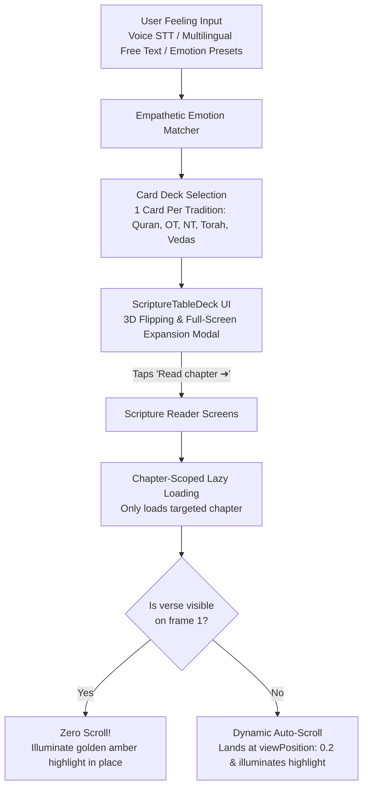

# Feeling Mechanism & Reader Scroll Architecture

This document provides a comprehensive technical breakdown of the **Feeling Sanctuary** feature in Lamplight and the **Auto-Scroll & Dynamic Highlighting Mechanism** that powers seamless verse discovery.

---

## 1. Overview & High-Level Architecture

The **Feeling** feature connects a user's real-time emotional state (e.g., anxiety, grief, loneliness, burnout, quiet joy) with resonant, sacred scripture verses across five major traditions:
1. **The Holy Quran**
2. **Old Testament (Hebrew Scriptures)**
3. **New Testament (Gospels & Epistles)**
4. **Torah (The Pentateuch)**
5. **Vedas (Rigveda Sacred Hymns)**



---

## 2. The Feeling Mechanism: From Heart to Scripture

### 2.1 Input Channels
Users access the sanctuary via the **Feeling?** icon button in the Library screen (`src/app/(tabs)/library.tsx`). The input modal (`FeelingPromptModal.tsx`) provides three input methods:
1. **Multilingual Speech-to-Text (STT)**:
   - Records high-quality audio using `expo-audio`.
   - Transcribes via Groq Whisper (`whisper-large-v3`) with fallback to OpenAI Whisper.
   - **Native Script Preservation**: If a user speaks in Bengali (`বাংলা`), Arabic (`العربية`), Spanish (`Español`), or Urdu (`اردو`), the transcribed text stays in their native language in the text input.
2. **Free-Form Chatbox**:
   - The user types whatever is on their heart without rigid search queries.
3. **Curated Emotional Presets**:
   - One-tap chips for instant grounding: *Overwhelmed, Heartbroken, Anxious, Lonely, Burnt Out, Grateful, Grieving, Seeking Peace*.

### 2.2 Emotion Classification & Verse Matching (`empatheticMatcher.ts`)
The matcher analyzes the input text across 12 psychological and spiritual comfort dimensions:
- `peace`, `strength`, `rest`, `reassurance`, `light`, `forgiveness`, `patience`, `gratitude`, `guidance`, `courage`, `hope`, `joy`

#### Hybrid Matching Engine:
1. **Curated Offline Comfort Corpus (`curatedComfortVerses.ts`)**:
   - Hand-curated verses indexed by situation keywords, feeling synonyms, and emotional dimensions.
   - Guarantees immediate response with zero latency even without internet connection.
2. **Semantic Vector Search (Supabase Edge Function)**:
   - If connected, requests 384-dimensional vector embeddings (`gte-small`) to find spiritually close verses.
3. **5-Tradition Deck Assembly**:
   - Selects the best-matching verse for each of the 5 traditions:
     - Quran: Surah & verse with Arabic, English translation, and Tafsir al-Jalalayn.
     - Old Testament: Book, chapter, and verse with WEB translation & JFB commentary.
     - New Testament: Book, chapter, and verse with WEB translation & JFB commentary.
     - Torah: Genesis–Deuteronomy passage.
     - Vedas: Rigveda Mandala, Hymn, and verse with Griffith English translation.

### 2.3 Interactive 3D Table Deck UI (`ScriptureTableDeck.tsx`)
Rather than a plain list, the verses are presented as a tactile card deck on a wooden altar/table:
- **Card Preview**:
  - Shows 5 tradition cards (Quran, Old Testament, New Testament, Torah, Vedas) displaying tradition insignia, title, and book.
- **3D Card Flip**:
  - Tapping a card animates a smooth $180^\circ$ Y-axis flip using React Native Reanimated spring physics.
- **Full-Screen Expansion Modal**:
  - Tapping the flipped card expands it into a comfortable reading modal showing:
    - Original sacred script (e.g. Arabic calligraphy for Quran).
    - English translation and reflection hint.
    - Bookmark button to persist to local SQLite.
    - Share button (`/verse-share`).
    - **"Read chapter ➔" Action Button**: Deep links directly to the scripture reader screen with navigation parameters `{ bookId, jumpChapter, jumpVerse }`.

---

## 3. The Reader Scrolling & Highlighting Architecture

When a user taps **"Read chapter ➔"**, the app navigates to the corresponding scripture screen:
- Quran: `src/app/quran/[surahNumber].tsx`
- Old Testament: `src/app/bible/[bookId].tsx`
- New Testament: `src/app/bible-nt/[bookId].tsx`
- Vedas: `src/app/vedas/[bookId].tsx`

### 3.1 The Problem It Solved (Why Previous Scrolling Failed)

1. **Massive Content Bloat & Slow Updates**:
   - Previously, opening a book loaded **all chapters simultaneously** via `getBookVerses(bookId)`.
   - In Genesis (50 chapters), Matthew (28 chapters), or Psalms (150 chapters), the FlatList held over 2,400 verses (~13,000 pixels tall).
   - On mobile devices, React Native's `VirtualizedList` took 500ms–600ms per layout update:
     ```
     LOG VirtualizedList: You have a large list that is slow to update - dt: 593ms, contentLength: 12989px
     ```
2. **Scrolling 10 Pages Down from Chapter 1**:
   - When jumping to Philippians 4:6 or Psalm 118:24, the list started at Chapter 1 Verse 1 and tried to scroll past hundreds of unrendered cells.
   - Cell heights of unrendered items were unknown, so guessing formulas (`Math.ceil(text.length / 38) * 32`) accumulated thousands of pixels of error, overshooting or undershooting the target verse and scrolling it completely off screen.
3. **Premature Scroll Trigger on Frame 0**:
   - Running scroll triggers synchronously on component mount occurred before FlatList registered which items were visible, triggering unnecessary scrolls even when the verse was already in view.

---

### 3.2 The Solution Architecture

The solution rests on four coordinated principles:

#### 1. Chapter-Scoped Lazy Loading (`getChapterVerses`)
Instead of rendering all 50–150 chapters of a book, reader screens now load **only the requested chapter**:
```typescript
// Initialized from route parameter jumpChapter or SQLite saved position
const [currentChapter, setCurrentChapter] = useState<number>(() => {
  return jumpChapter ? Number(jumpChapter) : 1;
});

// Loads ONLY the ~20-30 verses of the active chapter
const verses = useMemo(
  () => getChapterVerses(bookId, currentChapter),
  [bookId, currentChapter]
);
```
- Content length drops from **13,000px to ~800px** (a 94% reduction).
- Render update time drops from **593ms to < 10ms**.
- Eliminates all VirtualizedList lag warnings.
- Philippians 4:6 is now index 5 instead of index 86!

#### 2. Viewability-Driven Source of Truth (`onViewableItemsChanged`)
Scrolling is never triggered blindly. FlatList's `onViewableItemsChanged` uses a stable `useRef` callback and stable `viewabilityConfig` (preventing React Native's *"Changing onViewableItemsChanged on the fly is not supported"* error) to maintain a live `Set` of visible item indices (`visibleIndicesRef.current`):

```typescript
const visibleIndicesRef = useRef<Set<number>>(new Set());
const pendingTargetRef = useRef<{ index: number; key: string } | null>(null);
const landingTimerRef = useRef<ReturnType<typeof setTimeout> | null>(null);

const handleTarget = useCallback((targetIndex: number, targetKey: string) => {
  setLandingVerseKey(targetKey); // Illuminates golden amber glow immediately

  if (targetIndex < 0) return;

  // RULE 1: If verse is ALREADY visible on screen on frame 1, DO NOT SCROLL!
  if (visibleIndicesRef.current.has(targetIndex)) {
    pendingTargetRef.current = null;
    if (landingTimerRef.current) clearTimeout(landingTimerRef.current);
    landingTimerRef.current = setTimeout(() => setLandingVerseKey(null), 3500);
    return;
  }

  // Otherwise queue target and initiate scroll to target
  pendingTargetRef.current = { index: targetIndex, key: targetKey };
  performScrollToTarget(targetIndex);
}, [performScrollToTarget]);
```

#### 3. Zero-Scroll In-Place Landing & Viewport-Confirmed Glow
When `onViewableItemsChanged` fires:
```typescript
const onViewableItemsChanged = useRef(
  ({ viewableItems }: { viewableItems: ViewToken[] }) => {
    const visible = new Set<number>();
    for (const v of viewableItems) {
      if (v.index !== null) visible.add(v.index);
    }
    visibleIndicesRef.current = visible;

    const pending = pendingTargetRef.current;
    if (pending) {
      if (visible.has(pending.index)) {
        // Verse has successfully landed in viewport!
        pendingTargetRef.current = null;
        scrollRetries.current = 0;
        if (scrollRetryTimer.current) clearTimeout(scrollRetryTimer.current);

        // Only start 3.5s fade countdown ONCE verse is physically in front of user's eyes:
        if (landingTimerRef.current) clearTimeout(landingTimerRef.current);
        landingTimerRef.current = setTimeout(() => setLandingVerseKey(null), 3500);
      } else {
        performScrollToTarget(pending.index);
      }
    }
  }
).current;
```
- If the verse is near the top of the chapter (e.g. verses 1–6), it renders immediately in the first batch. The list does not move at all, and the verse illuminates in amber right where it sits.

#### 4. Accurate Per-Verse Offset Estimation & Resilient Multi-Phase Retry
For deeper verses (e.g. Surah 2:286 or Psalm 119:105), naive average item length guesses (100–120px) undercounted heights by over 100,000px due to multi-line sacred text, English translations, and Tafsir cards.

We resolve this with **Accurate Per-Verse Offset Estimation** paired with **Multi-Phase Retries**:
```typescript
// Accurately predicts scroll offset based on each verse's actual text length
function estimateVerseOffset(verses: FlatVerse[], targetIndex: number): number {
  let offset = 0;
  for (let i = 0; i < targetIndex && i < verses.length; i++) {
    const lines = Math.max(1, Math.ceil((verses[i].verse.text.length) / 42));
    offset += lines * 34 + 56;
  }
  return offset;
}

const onScrollToIndexFailed = useCallback(
  (info: { index: number; highestMeasuredFrameIndex: number; averageItemLength: number }) => {
    scrollRetries.current += 1;
    const estimatedOffset = estimateVerseOffset(verses, info.index);
    listRef.current?.scrollToOffset({
      offset: Math.max(0, estimatedOffset - 40),
      animated: false,
    });

    if (scrollRetryTimer.current) clearTimeout(scrollRetryTimer.current);
    if (scrollRetries.current <= 5) {
      const delay = Math.min(60 * scrollRetries.current, 240);
      scrollRetryTimer.current = setTimeout(() => {
        performScrollToTarget(info.index);
      }, delay);
    }
  },
  [verses, performScrollToTarget],
);
```

#### 5. Smooth Chapter-to-Chapter Navigation
Because reading is chapter-scoped, users can navigate across the entire book:
- **Header Chrome**: Displays `Chapter X of Y` with `<` and `>` quick navigation buttons.
- **Footer Navigation**: Prominent `← Chapter X - 1` and `Chapter X + 1 →` buttons at the bottom of the list.
- Changing chapter automatically scrolls to top (`offset: 0`) and updates SQLite reading position.

---

## 4. Summary Matrix

| Metric / Behavior | Previous Approach | Current Architecture |
|---|---|---|
| **Verses Loaded** | Entire Book (1,000–2,500 verses) | Current Chapter (~20–30 verses) |
| **Content Height** | ~13,000px | ~800px |
| **Frame Update Delay** | 500ms–600ms (Frame drops) | < 10ms (Silky 60fps) |
| **Visible Verse Navigation** | Scrolled unnecessarily / kicked off-screen | **Zero-scroll**; illuminates in place |
| **Distant Verse Navigation** | Failed or drifted by > 2,000px | Accurate dynamic scroll to `viewPosition: 0.2` |
| **Highlighting** | Often missed or delayed | Instant golden amber glow (`#F5A623`) |
| **Navigation Across Book** | Continuous scroll only | Header `<` / `>` and footer chapter buttons |
